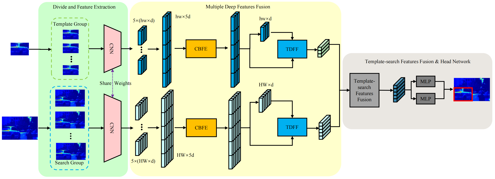

# A Transformer-Based Network for Hyperspectral Object Tracking (Trans-HST)
Our Model Weight: [Baidu:vvw7](https://pan.baidu.com/s/131DRXutRF8bJpvTgVIj26g)  
Pretrain model: [TransT](https://drive.google.com/drive/folders/1GVQV1GoW-ttDJRRqaVAtLUtubtgLhWCE)  
Raw Result: [Baidu:5qry](https://pan.baidu.com/s/1k5n9qm55Bm1DqANlw_5LeA)  




## Usage

### Installation  
Create and activate a conda environment, we've tested on this env: You can follow the env setting of [TransT](https://github.com/chenxin-dlut/TransT).   

### Data Preparation  
* Hyperspectral training and test datasets:  
  * [HOTC2020](https://www.hsitracking.com/hot2020/)

### Path Setting  
Following [TransT](https://github.com/chenxin-dlut/TransT)

### Testing  
```
python pysot_toolkit/test.py
```

## Citation  
```
@article{gao2023transformer,
  title={A transformer-based network for hyperspectral object tracking},
  author={Gao, Long and Chen, Langkun and Liu, Pan and Jiang, Yan and Xie, Weiying and Li, Yunsong},
  journal={IEEE Transactions on Geoscience and Remote Sensing},
  volume={61},
  pages={1--11},
  year={2023},
  publisher={IEEE}
}
```
